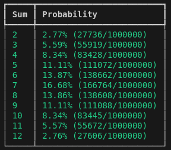

# Final project

### Завдання 7. Використання методу Монте-Карло

Таблиця анаілтичних розрахунків імовірності випадіння сумм двох гральних кубиків:

Таблиця розрахуків імоврностей випадіння сумм двох гральних кубиків методом Монте-Карло:

### Висновки
Було проведено симуляцію 1000000 кидків двох гральних кубиків і розрахувано імовірність  
випадіння кожної можливої їх суми методом Монте-Карло.  
У результаті ми наявно можемо побачити високу ефективність роботи цього методу при  
великій кількості симуляцій. Якщо подивитися на дві таблички вищє, то різниця між  
результатами мінімальна. Це доказує, що метод Монте-Карло доволі гарний інструмент  
для проведення експерементів, симулюючи потрібні умови з великою кількість випадкових даних.  
В рамках даної задачі він проявив собі доволі точно, але звичайно, такі показники можеть бути  
не завжди. В цілому Монте Карло має похибку, і не відноситься до точних алгоритмів.  
Точність залежить від велечини вибірки даних. Також, для підвищєння точносі результатів  
він потребує більшоє пам'яті. Це є одним із недоліків цього алгоритму.  
Там де пріорітетом є точність результатів цей алгоритм використовувати не можна.
